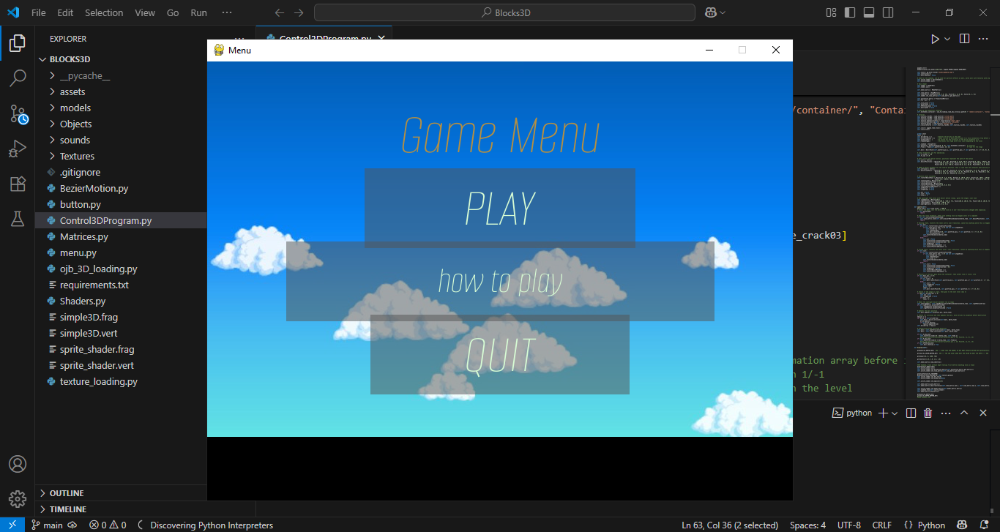
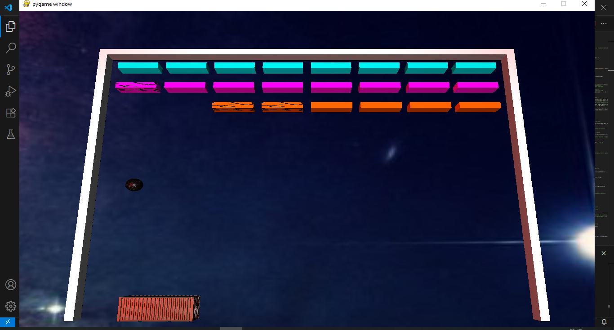

# Blocks3D
A 3D brick breaker game made using Python and the OpenGL pipeline for rendering.

**Windows users:** You can skip installation — just run [Launcher.exe](./Launcher.exe) to play the game instantly!


## Acknowledgements
 This project was completed using OpenGL as part of our Computer Graphics class. It served both as a challenge and a valuable learning experience. Along the way, we improved our skills and knowledge of the subjects covered in the course, thanks to tutorials and self-study. This is the final project for the class, and we decided to create a game because it's something that interests us and we found it fun and engaging. Despite being a simple game, it presented meaningful challenges related to 3D rendering, lighting, and collision detection — all of which helped us improve our development skills.

## Structure
This project is structured so that the assets, textures, models, audios and objects are separated by modules from the functionality of the program itself.
This is how the project looks like as of the last commit:
```txt
BLOCKS3D/
├── assets
│   ├── Background.png
│   ├── font.ttf
│   ├── Options Rect.png
│   ├── Play Rect.png
│   └── Quit Rect.png
│
├── Documentation
│   ├── screenshots
│   │     ├── Gameplay.png
│   │     ├── How_to_play.png
│   │     └── Menu.png
│   └── Documentation.pdf
│ 
├── models\container
│   ├── 10519_Pingpong_paddle_v1_L3.mtl
│   ├── 10519_Pingpong_paddle_v1_L3.obj
│   ├── Container.mtl
│   └── Container.obj
│
├── Objects
│   ├── Base3DObjects.py
│   ├── Environment.py
│   ├── Game3DObjects.py
│   └── GameBricks.py
│ 
├── sounds
│   ├── gameplay.mp3
│   ├── pop.mp3
│   └── PopPop.mp3
│
├── Textures
│  ├── Container.jpg
│  ├── crack1.png
│  ├── crack2.png
│  ├── crack3.png
│  ├── galaxy.jpg
│  ├── Sky.jpg
│  └── Stars.jpg
├── .gitignore
├── .BezierMotion.py
├── button.py
├── Control3DProgram.py
├── Matrices.py
├── menu.py
├── ojb_3D_loading.py
├── requirements.txt
├── Shaders.py
├── simple3D.frag
├── simple3D.vert
└── texture_loading.py
```
## Building
The project requires:
- Python >= 3.6
- Pip:
  - pygame == 2.5.2
  - pyopengl == 3.1.7
  - numpy == 1.26.4
  - glcontext == 2.5.0
  - moderngl == 5.10.0

To download the project, run:
 ```sh
 git clone https://github.com/Nymoz15/Blocks3D.git
 pip install -r requirements.txt
 ```
 Then run menu.py or to play

## Installer (Windows)

If you're on Windows, you can skip building from source and install the game directly using the provided executable:

 [Download and run **Launcher.exe**](./Launcher.exe)

This installer bundles everything needed to play — no Python setup required.
 
## Controls

| Action             | Key         |
|--------------------|-------------|
| Move platform      | A / D       |
| Launch ball        | Spacebar    |
| Pause game         | P           |
| Mute audio         | M           |

## Showcase video
Link to the video: 

[](https://www.youtube.com/watch?v=PRjFw_t8N-g)

## Documentation:
#### [Documentation](Documentation/Documentation.pdf)

## Authors
- Martínez González Ian Eduardo @Nymoz15
- Acuña Jirón Génesis Alexandra @WisePapuAlex





## License

This project is licensed under the MIT License.  
Check [LICENSE](./LICENSE) to get more information.
